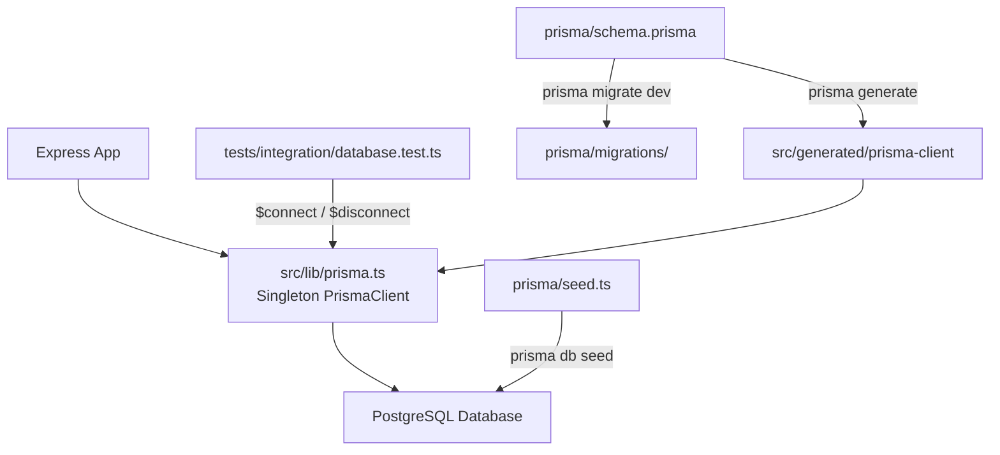
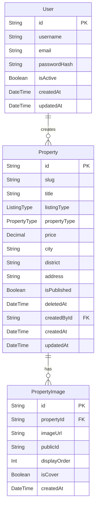

# Design Document: database-foundation

## Overview

Bu belge, gayrimenkul yönetim sisteminin Sprint 2 kapsamındaki veritabanı katmanının teknik tasarımını açıklar. Hedef; PostgreSQL üzerinde Prisma ORM kullanarak `User`, `Property` ve `PropertyImage` modellerini, bunların ilişkilerini, indekslerini, soft-delete mekanizmasını ve PrismaClient singleton servisini oluşturmaktır.

Sprint 1'de kurulan Express + TypeScript altyapısı değiştirilmeden genişletilir. Bu sprint kapsamında yalnızca veritabanı katmanı teslim edilir; authentication, controller/service katmanı ve frontend kapsam dışındadır.

**Kullanılan Teknolojiler:**
- PostgreSQL 15+ (ilişkisel veritabanı)
- Prisma ORM 5.x (şema yönetimi, migration, tip-güvenli client)
- `@prisma/client` — üretilen TypeScript istemcisi
- `ts-node` — seed scripti çalıştırmak için (zaten `ts-node-dev` kurulu)

---

## Architecture



### Katmanlı Tasarım

```
backend/
├── prisma/
│   ├── schema.prisma          # Veri modelleri, enum, indeks, ilişkiler
│   ├── seed.ts                # İdempotent başlangıç verisi
│   └── migrations/            # Otomatik oluşturulur — elle düzenlenmez
├── src/
│   ├── lib/
│   │   └── prisma.ts          # PrismaClient singleton
│   ├── generated/
│   │   └── prisma-client/     # prisma generate çıktısı — .gitignore'a eklenir
│   └── config/
│       └── env.ts             # DATABASE_URL burada okunur (mevcut)
└── tests/
    └── integration/
        └── database.test.ts   # Bağlantı doğrulama testi
```

### Tasarım Kararları

| Karar | Seçenek | Gerekçe |
|---|---|---|
| Client çıktı dizini | `./src/generated/prisma-client` | Sprint 1 modül yapısıyla uyumlu; `src/` altında kalır |
| Singleton konumu | `src/lib/prisma.ts` | `services/` klasörü ilerleyen sprintler için business logic'e ayrılmış; `lib/` saf altyapı için daha uygun |
| Decimal tipi | Prisma `Decimal` | Kayan nokta hatalarını önler; fiyat ve alan verisi için zorunlu |
| Seed stratejisi | `upsert` | İdempotent çalışma garantisi; veriler bozulmadan tekrar çalıştırılabilir |
| Global singleton | Yalnızca `development`'ta | Production'da gereksiz global state; yalnızca Hot Reload sorununu çözmek için kullanılır |

---

## Components and Interfaces

### 1. `src/lib/prisma.ts` — PrismaClient Singleton

**Sorumluluk:** Uygulama genelinde tek bir `PrismaClient` örneği sağlamak.

```typescript
// Dışa aktarılan arayüz
export const prisma: PrismaClient;
```

**Davranış Kuralları:**
- `NODE_ENV === 'development'`: `global.__prisma` üzerinden mevcut örnek yeniden kullanılır
- `NODE_ENV !== 'development'`: Modül kapsamında yeni örnek oluşturulur
- SIGTERM / SIGINT: `prisma.$disconnect()` çağrılır; hata sessizce yutulmaz

### 2. `prisma/schema.prisma` — Veri Modeli Tanımı

**Sorumluluk:** Tüm tabloları, enum'ları, ilişkileri ve indeksleri tek bir yetkili kaynak (single source of truth) olarak tanımlamak.

Anahtar kısıtlamalar:
- `datasource db` → provider: `postgresql`, url: `env("DATABASE_URL")`
- `generator client` → output: `"./src/generated/prisma-client"`

### 3. `prisma/seed.ts` — Seed Scripti

**Sorumluluk:** Geliştirme ortamı için başlangıç verisi; idempotent `upsert` ile çalışır.

Oluşturulan kayıtlar:
- 1 admin `User`
- 2 `Property` (biri `FOR_SALE`, biri `FOR_RENT`)
- Her ilana en az 1 `PropertyImage`

### 4. `tests/integration/database.test.ts` — Bağlantı Testi

**Sorumluluk:** PostgreSQL bağlantısının kurulabildiğini CI/CD ortamında doğrulamak.

```typescript
// Test senaryoları
describe('Database Connection')
  it('$connect() should resolve successfully')
  it('$disconnect() should close connection cleanly')
```

---

## Data Models

### Enum Tanımları

```prisma
enum ListingType {
  FOR_SALE
  FOR_RENT
}

enum PropertyType {
  APARTMENT
  HOUSE
  LAND
  OFFICE
  SHOP
  WAREHOUSE
  OTHER
}

enum HeatingType {
  NATURAL_GAS
  ELECTRIC
  FLOOR_HEATING
  COAL
  NONE
  OTHER
}

enum DeedStatus {
  FREEHOLD
  CONDOMINIUM
  FLOOR_EASEMENT
  SHARED
  OTHER
}
```

### User Modeli

| Alan | Tip | Kısıt |
|---|---|---|
| id | String | UUID, PK, `@default(uuid())` |
| username | String | max 50 karakter, `@unique` |
| email | String | max 254 karakter, `@unique` (case-insensitive için veritabanı seviyesinde unique index) |
| passwordHash | String | min 60 karakter (bcrypt hash) |
| isActive | Boolean | `@default(true)` |
| createdAt | DateTime | `@default(now())` |
| updatedAt | DateTime | `@updatedAt` |
| properties | Property[] | Relation field |

**Not — E-posta case-insensitivity:** Prisma şemasında `@unique` ile tanımlı olan `email` alanı, migration sonrası `CREATE UNIQUE INDEX ... ON "User" (lower(email))` şeklinde bir ham SQL migration ile desteklenmelidir. Prisma 5.x fonksiyonlu indeks tanımını `@@index([email(ops: raw("citext_ops"))])` ile desteklemez; `citext` extension veya manuel migration tercih edilir.

> **Tasarım Kararı:** Sprint 2 kapsamında `email` unique kısıtı standart Prisma `@unique` ile kurulur. Case-insensitive kısıt, `prisma/migrations` içine el ile bir SQL adımı eklenerek ilerleyen sprintte uygulanabilir. Bu sprint için auth katmanı bulunmadığından seed'de küçük harfli e-posta kullanmak yeterlidir.

### Property Modeli

| Alan | Tip | Kısıt / Default |
|---|---|---|
| id | String | UUID, PK |
| slug | String | `@unique` |
| title | String | — |
| listingType | ListingType | Enum |
| propertyType | PropertyType | Enum |
| price | Decimal | — |
| city | String | — |
| district | String | — |
| address | String | — |
| description | String? | Opsiyonel |
| neighborhood | String? | Opsiyonel |
| grossArea | Decimal? | Opsiyonel |
| netArea | Decimal? | Opsiyonel |
| roomCount | Int? | Opsiyonel |
| livingRoomCount | Int? | Opsiyonel |
| bathroomCount | Int? | Opsiyonel |
| floor | Int? | Opsiyonel |
| totalFloor | Int? | Opsiyonel |
| buildingAge | Int? | Opsiyonel |
| heatingType | HeatingType? | Opsiyonel |
| dues | Decimal? | Opsiyonel |
| deedStatus | DeedStatus? | Opsiyonel |
| latitude | Float? | Opsiyonel |
| longitude | Float? | Opsiyonel |
| videoUrl | String? | Opsiyonel |
| virtualTourUrl | String? | Opsiyonel |
| furnished | Boolean | `@default(false)` |
| balcony | Boolean | `@default(false)` |
| elevator | Boolean | `@default(false)` |
| parking | Boolean | `@default(false)` |
| eligibleForCredit | Boolean | `@default(false)` |
| exchangeAvailable | Boolean | `@default(false)` |
| isFeatured | Boolean | `@default(false)` |
| isPublished | Boolean | `@default(false)` |
| createdAt | DateTime | `@default(now())` |
| updatedAt | DateTime | `@updatedAt` |
| deletedAt | DateTime? | Soft delete — `null` ise aktif |
| createdById | String | FK → User.id |
| createdBy | User | Relation field |
| images | PropertyImage[] | Relation field |

**İndeksler:**

```prisma
@@index([city])
@@index([district])
@@index([price])
@@index([listingType])
@@index([propertyType])
@@index([isPublished])
@@index([deletedAt])
@@index([createdById])
@@index([city, listingType, isPublished])   // Composite — en yaygın listeleme filtresi
```

### PropertyImage Modeli

| Alan | Tip | Kısıt / Default |
|---|---|---|
| id | String | UUID, PK |
| propertyId | String | FK → Property.id, `onDelete: Cascade` |
| imageUrl | String | max 2048 karakter |
| publicId | String | max 255 karakter (Cloudinary public ID) |
| displayOrder | Int | — |
| isCover | Boolean | `@default(false)` |
| createdAt | DateTime | `@default(now())` |
| property | Property | Relation field |

**Kısıtlar:**

```prisma
@@unique([propertyId, displayOrder])   // Aynı ilan içinde aynı sıraya izin yok
```

**Kısmi Unique — Kapak Fotoğrafı:** `isCover = true` olan yalnızca bir `PropertyImage` olabilir per property. Prisma `@@unique` filtreli partial index desteklemez; bu kısıt, uygulama katmanında (service) zorunlu kılınır ve migration'a ham SQL eklenerek de uygulanabilir:

```sql
CREATE UNIQUE INDEX "PropertyImage_propertyId_isCover_key"
ON "PropertyImage"("propertyId")
WHERE "isCover" = true;
```

### İlişki Diyagramı



### Referans Bütünlüğü Kuralları

| İlişki | onDelete | Gerekçe |
|---|---|---|
| `PropertyImage → Property` | `Cascade` | İlan silinince fotoğrafları da silinmeli |
| `Property → User` | `Restrict` | Kullanıcı silinince aktif ilanlar korunmalı |

---

## Correctness Properties

*A property is a characteristic or behavior that should hold true across all valid executions of a system — essentially, a formal statement about what the system should do. Properties serve as the bridge between human-readable specifications and machine-verifiable correctness guarantees.*


### Property 1: User E-posta Unique Kısıtı (Case-Insensitive)

*For any* iki farklı e-posta adresi string'i —  büyük/küçük harf farkı gözetilmeksizin aynı kanonize değere sahip olanlar (örn. `user@example.com` ve `USER@EXAMPLE.COM`) — ikisi de `User` tablosuna eklenmeye çalışıldığında, ikinci kayıt oluşturma işlemi reddedilmeli ve tablodaki kayıt sayısı değişmemelidir.

**Validates: Requirements 2.2, 2.4**

---

### Property 2: User Kullanıcı Adı Unique Kısıtı

*For any* username string'i, aynı değer iki farklı `User` kaydı için kullanılmaya çalışıldığında, ikinci kayıt oluşturma işlemi reddedilmeli ve tablodaki kayıt sayısı değişmemelidir.

**Validates: Requirements 2.3, 2.5**

---

### Property 3: Property Soft-Delete Lifecycle

*For any* `Property` kaydı: (a) soft-delete yapıldığında `deletedAt` alanı dolu olmalı ve kayıt fiziksel olarak var olmaya devam etmeli; (b) varsayılan aktif sorguları (deletedAt IS NULL filtreli) bu kaydı döndürmemeli; (c) geri yükleme yapıldığında `deletedAt` tekrar `null` olmalı ve kayıt aktif sorgularda görünür hale gelmelidir.

**Validates: Requirements 4.7, 8.2, 8.3, 8.4**

---

### Property 4: PropertyImage Composite Unique — DisplayOrder

*For any* `Property` kaydı için, aynı `(propertyId, displayOrder)` çiftini kullanan ikinci `PropertyImage` kaydı oluşturma girişimi reddedilmeli; farklı `displayOrder` değerleri ise bağımsız kayıtlar olarak kabul edilmelidir.

**Validates: Requirements 5.2**

---

### Property 5: PropertyImage Cascade Delete

*For any* N adet `PropertyImage` kaydına sahip `Property`, o `Property` kaydı fiziksel olarak silindiğinde, tüm N adet ilişkili `PropertyImage` kaydı da otomatik olarak silinmeli ve veritabanında sahipsiz (orphan) kayıt kalmamalıdır.

**Validates: Requirements 5.4, 5.5, 6.4**

---

### Property 6: User Restrict FK — Aktif İlanı Olan Kullanıcı Silinemez

*For any* `User` kaydı, o kullanıcıya ait `deletedAt IS NULL` olan en az bir `Property` kaydı varken kullanıcıyı silme girişimi, referans bütünlüğü hatası ile reddedilmeli; hem kullanıcı hem de bağlı ilanlar varlığını korumalıdır.

**Validates: Requirements 6.5**

---

### Property 7: Seed İdempotency

*For any* N ≥ 1 kez arka arkaya çalıştırılan seed scripti, her çalıştırma sonrasında `User`, `Property` ve `PropertyImage` tablolarındaki kayıt sayıları sabit kalmalıdır; seed önceden var olan kayıtları çoğaltmamalıdır.

**Validates: Requirements 10.4**

---

### Property 8: PropertyImage Kapak Fotoğrafı Uniqueness

*For any* `Property` kaydı için, `isCover = true` olan ikinci bir `PropertyImage` kaydı oluşturma girişimi reddedilmeli; bir ilana yalnızca bir kapak fotoğrafı atanabilmelidir.

**Validates: Requirements 5.3**

---

## Error Handling

### Veritabanı Bağlantı Hataları

| Senaryo | Davranış |
|---|---|
| `DATABASE_URL` eksik | `env.ts` Zod validasyonu startup'ta `process.exit(1)` — mevcut davranış |
| Bağlantı kurulamıyor | `PrismaClient` hata fırlatır; `server.ts`'deki `unhandledRejection` handler yakalar |
| SIGTERM / SIGINT | `prisma.$disconnect()` çağrılır; hata loglama ile `process.exit(0)` |
| `$disconnect()` başarısız | Hata konsola yazılır (`console.error`), ardından `process.exit(1)` |

### Prisma Hata Sınıflandırması

Servis katmanı ilerleyen sprintlerde aşağıdaki Prisma hata kodlarını ele alacaktır:

| Kod | Anlam | Örnek |
|---|---|---|
| `P2002` | Unique constraint ihlali | Aynı email / username / slug |
| `P2003` | FK constraint ihlali | Geçersiz `createdById` |
| `P2025` | Kayıt bulunamadı | `update` / `delete` hedefi yok |
| `P2014` | Restrict ihlali | Aktif ilanı olan kullanıcı silme |

> Bu sprint kapsamında hata kodları yalnızca şema ve test düzeyinde belgelenir; Express error handler entegrasyonu sonraki sprint'e bırakılır.

### Seed Hata Yönetimi

```
seed.ts başlar
  → Bağlantı kur
  → upsert User (hata → console.error + process.exit(1))
  → upsert Property x2 (hata → rollback yok; idempotent upsert zaten güvenli)
  → upsert PropertyImage (hata → loglama)
  → $disconnect()
  → Sonuç özetini yaz
```

---

## Testing Strategy

### Genel Yaklaşım

Bu özellik iki katmanlı test stratejisi kullanır:

1. **Birim Testleri** — Singleton pattern, ortam değişkeni doğrulama, signal handler davranışı
2. **Property-Based Testler** — Unique kısıtlar, cascade/restrict davranışı, soft-delete lifecycle, seed idempotency
3. **Integration Testleri** — Gerçek PostgreSQL bağlantısı doğrulama (`prisma.$connect()`)

Property-based test kütüphanesi: **`fast-check`** (zaten `devDependencies`'te mevcut)

Her property testi minimum **100 iterasyon** ile çalıştırılır.

### Test Dosyaları

```
tests/
├── integration/
│   └── database.test.ts          # $connect / $disconnect (Requirements 11.x)
└── unit/
    ├── lib/
    │   └── prisma.test.ts         # Singleton, signal handler (Requirements 9.x)
    └── database/
        ├── user-constraints.test.ts    # Property 1, 2 (Requirements 2.x)
        ├── property-softdelete.test.ts # Property 3 (Requirements 4.7, 8.x)
        ├── property-image.test.ts      # Property 4, 5, 8 (Requirements 5.x)
        ├── relations.test.ts           # Property 6 (Requirements 6.5)
        └── seed.test.ts                # Property 7 (Requirements 10.4)
```

### Property Test Konfigürasyonu

```typescript
// fast-check konfigürasyonu
fc.assert(
  fc.property(arbitraryInput, (input) => {
    // test body
  }),
  { numRuns: 100 }  // Minimum 100 iterasyon
);
```

### Test Tag Formatı

Her property testi şu yorum satırını içermelidir:

```typescript
/**
 * Feature: database-foundation, Property {N}: {property_text}
 * Validates: Requirements X.Y
 */
```

### Property Test Detayları

#### Property 1: User Email Unique (Case-Insensitive)
```typescript
// Arbitrary: fc.emailAddress() veya fc.string() ile email üret
// Dönüşüm: toUpperCase() varyantı oluştur
// Eylem: İkisini de insert etmeye çalış
// Assert: İkinci insert PrismaClientKnownRequestError (P2002) fırlatmalı
```

#### Property 2: User Username Unique
```typescript
// Arbitrary: fc.string({ minLength: 1, maxLength: 50 }) — alfanumerik
// Eylem: Aynı username ile iki kayıt oluşturmayı dene
// Assert: İkinci insert P2002 fırlatmalı
```

#### Property 3: Soft-Delete Lifecycle
```typescript
// Arbitrary: Property için geçerli alan değerleri
// Eylem 1: Property oluştur → soft-delete (deletedAt doldur)
// Assert 1: deletedAt !== null, fiziksel kayıt var
// Eylem 2: Varsayılan sorgu (deletedAt IS NULL filtreli)
// Assert 2: Kayıt sorgu sonucunda yok
// Eylem 3: Restore (deletedAt = null)
// Assert 3: Kayıt tekrar sorguda görünür
```

#### Property 4: PropertyImage DisplayOrder Unique
```typescript
// Arbitrary: propertyId ve displayOrder (Int)
// Eylem: Aynı (propertyId, displayOrder) ile iki image oluşturmayı dene
// Assert: İkinci insert P2002 fırlatmalı
```

#### Property 5: Cascade Delete
```typescript
// Arbitrary: fc.integer({ min: 1, max: 10 }) — image sayısı
// Eylem: N image'a sahip Property oluştur → Property'yi sil
// Assert: PropertyImage count = 0
```

#### Property 6: User Restrict FK
```typescript
// Arbitrary: fc.integer({ min: 1, max: 5 }) — aktif ilan sayısı
// Eylem: N aktif ilanı olan User oluştur → User'ı silmeye çalış
// Assert: PrismaClientKnownRequestError (P2014 veya P2003)
```

#### Property 7: Seed Idempotency
```typescript
// Eylem: seed() fonksiyonunu 3 kez çalıştır
// Assert: Her çalıştırma sonrası User, Property, PropertyImage count sabit
```

#### Property 8: isCover Partial Unique
```typescript
// Arbitrary: propertyId
// Eylem: Aynı Property için iki isCover=true PropertyImage oluşturmayı dene
// Assert: İkincisi P2002 veya uygulama katmanı hatası fırlatmalı
```

### Integration Test

```typescript
// tests/integration/database.test.ts
// Gerçek PostgreSQL bağlantısı — CI ortamında PostgreSQL servisi gerekli
describe('Database Connection')
  beforeAll: prisma.$connect()
  afterAll: prisma.$disconnect()
  it('connects successfully') → expect no error
  it('executes a raw query') → prisma.$queryRaw`SELECT 1`
```

### CI/CD Notu

Integration testleri (`tests/integration/database.test.ts`) PostgreSQL servisine ihtiyaç duyar. CI pipeline'da:

```yaml
services:
  postgres:
    image: postgres:15
    env:
      POSTGRES_DB: gayrimenkul_test
      POSTGRES_USER: test
      POSTGRES_PASSWORD: test
```

Property-based testler ise mock PrismaClient kullanılarak izole biçimde çalıştırılabilir; gerçek veritabanı gerektirmez.

